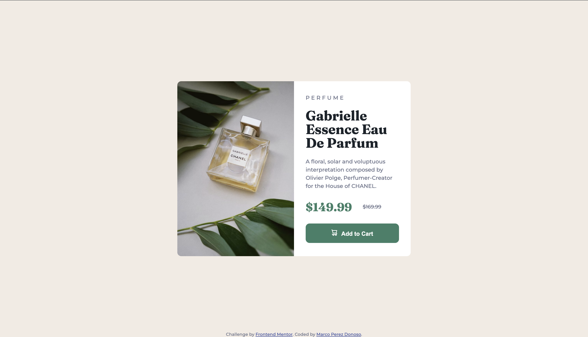

# Frontend Mentor - Product preview card component solution

This is a solution to the [Product preview card component challenge on Frontend Mentor](https://www.frontendmentor.io/challenges/product-preview-card-component-GO7UmttRfa). 

## Table of contents

- [Overview](#overview)
  - [Screenshot](#screenshot)
  - [Links](#links)
- [My process](#my-process)
  - [Built with](#built-with)
  - [What I learned](#what-i-learned)
  - [Useful resources](#useful-resources)
- [Author](#author)
- [Acknowledgments](#acknowledgments)


## Overview

### Screenshot



### Links

- Solution URL: [Solution URL](https://github.com/marcopdonoso/Product-preview-card-component)
- Live Site URL: [Live site URL](https://marcopdonoso.github.io/Product-preview-card-component/)

## My process

### Built with

- Semantic HTML5 markup
- CSS custom properties

### What I learned

One thing I learned doing this project, using only CSS custom properties and no Flexbox or Grid, is to center elements using a combination of absolute positioning and the transform property with the translate function.

This is an example of that:

```html
<div class="text-container">
  <h2>PERFUME</h2>

  <h1>Gabrielle Essence Eau De Parfum</h1>

  <p class="description-paragraph">A floral, solar and voluptuous interpretation composed by Olivier Polge, Perfumer-Creator for the House of CHANEL.</p>

  <p class="offer-price">$149.99</p>
  <p class="listed-price">$169.99</p>

  <button class="btn">Add to Cart</button>
</div>
```
```css
.text-container {
  position: absolute;
  height: 90%;
  left: 50%;
  top: 50%;
  transform: translate(-50%, -50%);
  width: 80%;
}
```

### Useful resources

- [How TO - Center Elements Vertically](https://www.w3schools.com/howto/howto_css_center-vertical.asp) - This helped me for centering elements without using Flex or Grid. I really liked this pattern and will use it going forward.


## Author

- Website - [Marco Perez Donoso](https://marcopdonoso.github.io)
- Frontend Mentor - [@marcopdonoso](https://www.frontendmentor.io/profile/marcopdonoso)
- Twitter - [@marcopdonoso](https://twitter.com/marcopdonoso)